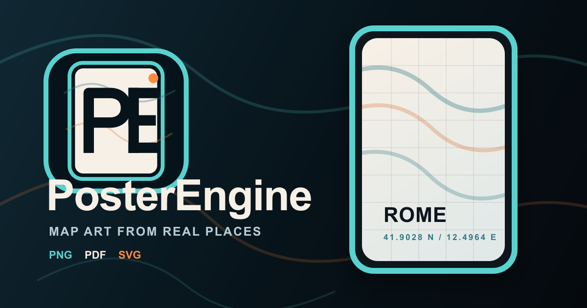

# PosterEngine

PosterEngine is a lightweight browser app for creating custom map posters and wallpapers from real OpenStreetMap data. Pick a location, tune the map style, adjust the poster layout, add optional markers, then export a print-ready PNG, PDF, or layered SVG.

The repository may still appear under the historical `terraink` name in some tooling, but the product branding to preserve is **PosterEngine**.

## Features

- Custom city map posters for any location in the world
- Location search and reverse geocoding through Nominatim
- Curated map themes with custom color overrides
- Layer controls for landcover, buildings, water, parks, roads, rail, and aeroway
- Marker placement with built-in and uploaded marker icons
- Typography controls for poster labels and Google Fonts
- High-resolution PNG, PDF, and layered SVG export
- PWA support with a small service worker for static assets and map tiles

## Mapping Stack

- **Map data**: [OpenStreetMap contributors](https://www.openstreetmap.org/copyright)
- **Tiles**: [OpenMapTiles](https://openmaptiles.org/)
- **Tile hosting**: [OpenFreeMap](https://openfreemap.org/)
- **Geocoding**: [Nominatim](https://nominatim.openstreetmap.org/)
- **Map renderer**: [MapLibre GL JS](https://maplibre.org/)

## User Interface


## Showcase

Showcase images are stored in `public/assets/showcase/`.

<p align="center">
  
  
</p>

## Run

```bash
bun install
bun run dev
```

The development server runs at `http://localhost:5173`.

## Environment

Check [`.env.example`](./.env.example) for available variables. They are optional for most local work and should not be set during testing unless a specific case requires them.

## Build

```bash
bun run build
```

## Docker

Build and run with Docker Compose:

```bash
docker compose up -d --build
```

The app is served on `http://localhost:7203` by default. Override the host port with `APP_PORT`.

```powershell
$env:APP_PORT=80
docker compose up -d --build
```

Stop the deployment:

```bash
docker compose down
```

Build and run without Compose:

```bash
docker build -t posterengine:latest .
docker run -d --name posterengine -p 7203:80 --restart unless-stopped posterengine:latest
```

## Architecture

Read [agent.md](./agent.md) before changing code. The app uses a feature-based clean architecture:

- `src/features/*/domain` for pure types and logic
- `src/features/*/application` for use-case hooks
- `src/features/*/infrastructure` for concrete adapters and browser APIs
- `src/features/*/ui` for React components
- `src/core/services.ts` for pre-wired services consumed by application hooks

## Contributing

Read [CONTRIBUTING.md](./CONTRIBUTING.md) before opening a PR.

- Branch from `dev` and target `dev` when that branch is available.
- Keep changes focused and aligned with the architecture.
- Run `bun install` and `bun run build` before submitting changes.
- Include screenshots or a demo for visible UI changes.

## License

As of April 3, 2026, new changes to this repository are licensed under [AGPL-3.0](LICENSE). Code released before that date remains under the [MIT License](LICENSE-OLD).

If you deploy or modify the open-source version, you are responsible for complying with the AGPL-3.0 license, including preserving license and attribution notices.

## Attribution

- Map data: OpenStreetMap contributors, licensed under [ODbL](https://opendatacommons.org/licenses/odbl/)
- Tile schema: OpenMapTiles, licensed under [ODbL](https://openmaptiles.org/docs/tileset/openmaptiles/)
- Tile hosting: OpenFreeMap
- Geocoding: Nominatim / OpenStreetMap data
- Map renderer: MapLibre GL JS, licensed under [BSD-3-Clause](https://github.com/maplibre/maplibre-gl-js/blob/main/LICENSE.txt)

## Acknowledgment

PosterEngine evolved from the historical Terraink codebase and was inspired by [MapToPoster](https://github.com/originalankur/maptoposter) by [Ankur Gupta](https://github.com/originalankur), originally released under the MIT license.
